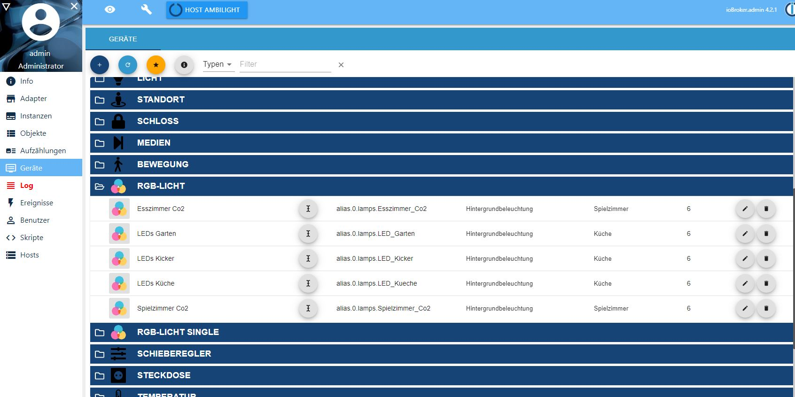

# Automatische Erkennung

Dieser Weg `entities` zu erstellen ist immer zu bevorzugen, wenn möglich. Für die Erkennung wird eine ioBroker 
Bibliothek Namens `type-dector` genutzt. Diese ist auch in anderen Adaptern, wie `iot` oder `material` in Verwendung. 
Wenn die Geräte für einen dieser Adapter sauber konfiguriert sind, profitieren also gleich mehrere.

Mittlerweile gibt es mit dem [Geräte Adapter](https://github.com/iobroker/iobroker.devices) auch eine UI für den `type-dector`.
Es wird daher dringend empfohlen, falls noch nicht geschehen, diesen Adapter zu installieren und den Tab im Admin zu aktivieren.
Dort tauchen alle erkannten Geräte auf. Diese können potenziell auch in Lovelace verwendet werden.

So sieht die Übersicht über die erkannten Geräte aus:

Für die Erkennung ist es wichtig, dass die States der Geräte die richtigen Rollen und Typen (Nummer, String, Boolean, ..) haben.
Sollte das bei einem eurer Geräte nicht der Fall sein, empfiehlt es sich mit der Alias-Funktion des js-Controllers ein
Gerät zusammenzustellen. Am einfachsten geht dies ebenfalls im *Geräte-Tab* im Admin. Dort kann für die States
eines Geräts jeweils ein vorhandenes Objekt ausgewählt werden. Die Rollen und anderen Eigenschaften werden dann beim 
Alias direkt richtig gesetzt, so, dass die Erkennung funktioniert.

Nachdem der Ordner, der Typ und Raum und Funktion angegeben wurde, werden so die einzelnen States angegeben:

Lovelace wird alle Geräte, die im Geräte-Tab dargestellt werden und die Raum **und** Funktion zugewiesen haben erkennen.
Geräte, bei denen eins von beiden fehlt, werden ignoriert.

In den Instanzeinstellungen kann man bei komplexeren Objekten dann sehen, dass mehrere States zu einer `entity` 
zusammen gesetzt werden, ein Beispiel:

Zu sehen ist ein Licht (`light`), das Farbe, Farbtemperatur und Dimmen unterstützt. Insgesamt sind dies 4 ioBroker 
States in einem Objekt.
