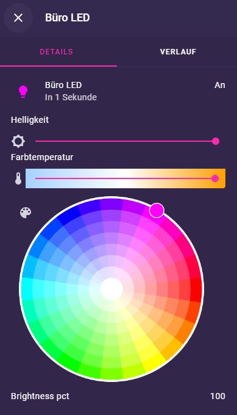

# Unterstützte Entities

Die folgenden Entities werden vom Adapter angelegt oder können manuell konfiguriert werden.
Angegeben ist jeweils die `Domain`, also der Teil mit der der entity in Lovelace anfangen wird (z.B. `light` bei 
entity `light.kueche`), die ioBroker Geräte, die bei automatischer Erkennung zu diesem entity führen. 

## Inhalt

[Licht](supported_entities.md#licht)
[Sensoren](supported_entities.md#sensoren)

## Licht

Domain: `light`

ioBroker Geräte:
* Licht (`light`)
* Dimmer (`dimmer`)
* Farbtemperatur (`ct`)
* RGB Licht (`rgb`)
* RGB-Licht Single (`rgbSingle`)
* HUE-Licht (`hue`)

ioBroker ist hier etwas besonders und sortiert die Lampen, je nach Fähigkeiten in sehr unterschiedliche Geräteklassen ein. So
gibt es drei Klassen für Lampen, die farbiges Licht erzeugen können (`rgb`, `rgbSingle`, `hue`). Natürlich können diese
zusätzlich (optional) einen Dimmer oder die Farbtemperatur-Einstellung haben. Es wird immer die Klasse mit den meisten
Fähigkeiten genommen.
Bei der manuellen Konfiguration ist aktuell nur an/aus und ggf. dimmen möglich. Lichter mit den erweiterten Fähigkeiten 
benötigen zwingend die automatische Erkennung.

Ein Beispiel eines komplexen Lichts in Lovelace (more-info Karte):

## Sensoren

Domain: `sensor`

ioBroker Geräte:
* Fensterkippung (`windowTilt`)
* Feuchtigkeit (`humidity`)
* Temperatur (`temperature`)

Obwohl Sensoren meist nur aus einem ioBroker-State bestehen und daher grundsätzlich auch die manuelle Konfiguration in Frage
kommt, empfiehlt sich trotzdem die automatische Erkennung zu nutzen, da dann das Attribut `device_class` (Geräteklasse) 
richtig gefüllt werden kann und Lovelace so z.B. das richtige Icon und die richtige Einheit setzt.

## Sensoren

Domain: `sensor`

ioBroker Geräte:
* Fensterkippung (`window`)
* Feuchtigkeit (`humidity`)
* Temperatur (`temperature`)

Obwohl Sensoren meist nur aus einem ioBroker-State bestehen und daher grundsätzlich auch die manuelle Konfiguration in Frage
kommt, empfiehlt sich trotzdem die automatische Erkennung zu nutzen, da dann das Attribut `device_class` (Geräteklasse)
richtig gefüllt werden kann und Lovelace so z.B. das richtige Icon und die richtige Einheit setzt.

[Types.socket]:                 processSocket.bind(this),
            [Types.motion]:                 processBinarySensors.processMotion.bind(this),
            [Types.window]:                 processBinarySensors.processWindow.bind(this),
            [Types.door]:                   processBinarySensors.processDoor.bind(this),
            [Types.button]:                 processSocket.bind(this),
            [Types.lock]:                   processLock.bind(this),
            [Types.thermostat]:             processThermostat.bind(this),
            [Types.blind]:                  processBlind.bind(this),
            [Types.blindButtons]:           processBlind.bind(this),
            [Types.weatherForecast]:        converterWeather.processWeather.bind(this),
            [Types.accuWeatherForecast]:    converterWeather.processAccuWeather.bind(this),
            [Types.location]:               processLocation.bind(this),
            [Types.location_one]:           processLocation.bind(this),
            [Types.media]:                  processMediaPlayer.bind(this),
            [Types.image]:                  processImage.bind(this),
